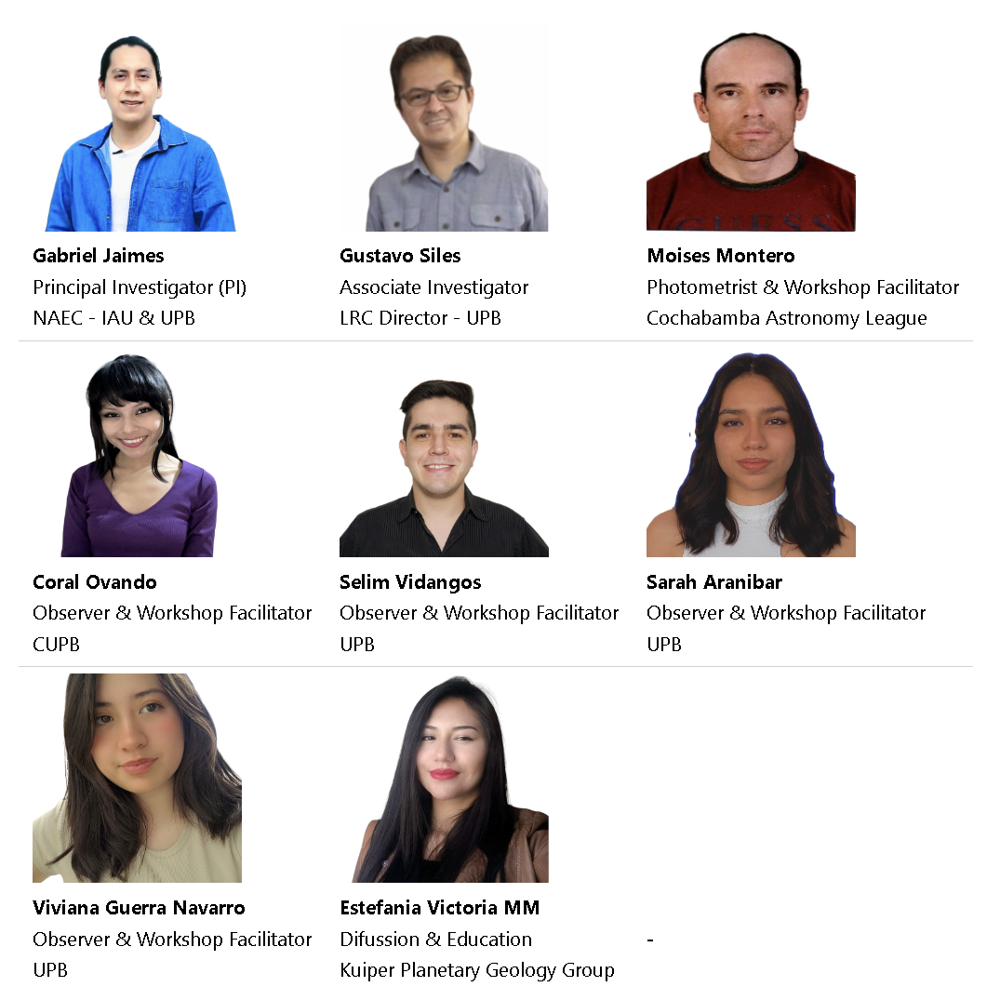
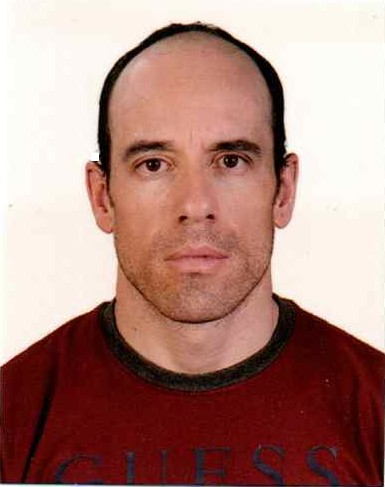
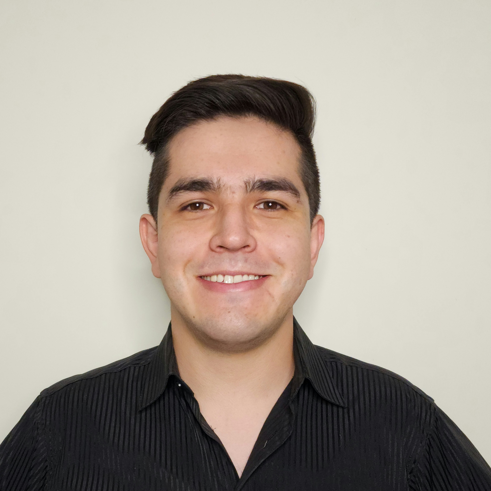

---

# The Team

---

The development team is made up of professionals with experience in the area, graduates, researchers, interns and collaborators in the areas of electronics, aeronautics, astrophysics, telecommunications, geology, computing and education.

<!--

<table>
  <tr>
    <td> <strong>Gabriel Jaimes</strong> Principal Investigator (PI) NAEC - IAU & UPB</td>
    <td> <strong>Gustavo Siles</strong> Investigator LRC Director - UPB</td>
    <td> <strong>Moises Montero</strong> Photometrist & Workshop Facilitator Cochabamba Astronomy League</td>
  </tr>
  <tr>
    <td> <strong>Coral Ovando</strong> Observer & Workshop Facilitator UPB</td>
    <td> <strong>Selim Vidangos</strong> Observer & Workshop Facilitator UPB</td>
    <td> <strong>Sarah Aranibar</strong> Observer & Workshop Facilitator UPB</td>
  </tr>
  <tr>
    <td> <strong>Viviana Guerra Navarro</strong> Observer & Workshop Facilitator UPB</td>
    <td> <strong>Estefania Victoria MM</strong> Difussion & Education Kuiper Planetary Geology Group</td>
    <td> <strong>-</strong></td>
  </tr>
</table>
-->